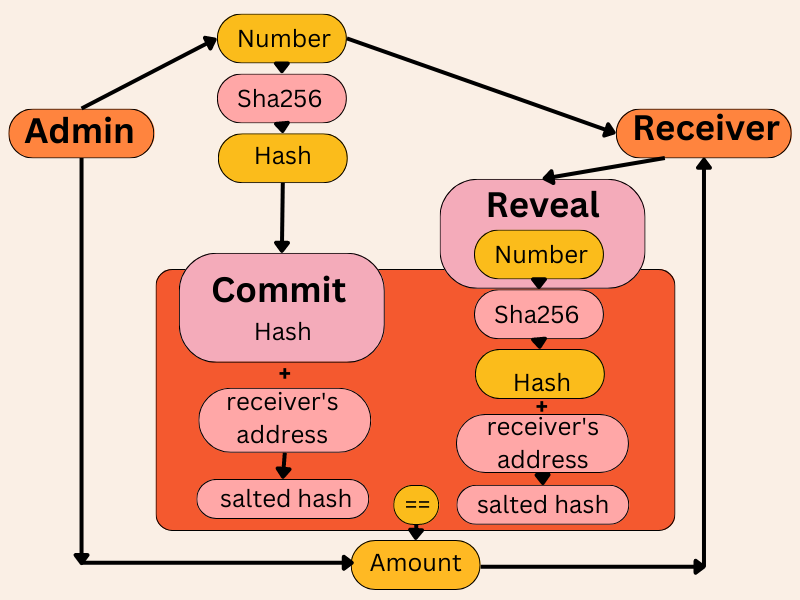

## Hashlock + Timelock Tezos Smart Contract

#### Address: ***KT1MkwdjF6KUnUrR268MGN5Ue6W2zNsYiM4c***

#### Description:
The source code in the .tz file is a smart contract that can be deployed in the Tezos Blockchain. It is transpiled in Michelson from SmartPy (the function of which is to make smart contract development easier).

The goal of the hashlock/timelock smart contract is to contain tez (Tezos' native coin) and transfer it to the intended receiver after some time, if the caller can cryptographically prove that he is the intended receiver. It has two callable functions: 1. Commit and 2. Reveal.

The way it works is that the sender of the tez (who is also the originator of the contract) can choose a random number and find its sha256 hash. He then, and only he can call the "commit” function and can feed three arguments to it: the intended receiver’s address, the hash of the random number and the amount he wants to send. The algorithm salts the hash with the receiver's address.

On other communication channels the admin sends the random number to the intended receiver. The “reveal” function takes a number as an argument (the random number that admin chose), hashes it, salts it with the caller’s address and hashes the salted concatenation again with sha256. The function is callable by everyone, but because of the way the algorithm hashes and salts the hash with the caller’s address, it only “reveals” when called by the intended receiver. The reveal in this case is a transaction call that sends the amount of tez to the receiver’s address.

*[sha256](https://en.wikipedia.org/wiki/SHA-2 "sha256") is a cryptographic hashing function 

#### How to use the contract:
This exact contract is deployed in the Ghostnet of Tezos with this contract address: ***KT1MkwdjF6KUnUrR268MGN5Ue6W2zNsYiM4c***. You’ll need a Tezos address to interact with it. However note that only the originator address can call the “commit” function and the “reveal” function won’t work unless you are the intended receiver.

In order to fully interact with the contract, you’ll need to deploy a copy of it in a testnet with your own address, so that you can be the admin. Another way to test the functionalities of the contract is to use SmartPy’s online editor. A full test scenario is written in the SmartPy file which you can paste in the editor and the output panel should be updated after clicking “run”. Better Call Dev is another tool that can be used to interact with Tezos Smart Contracts.

*[SmartPy Explorer view](https://smartpy.io/explorer?address=KT1MkwdjF6KUnUrR268MGN5Ue6W2zNsYiM4c "SmartPy Explorer view")

*[Better Call Dev view](https://better-call.dev/ghostnet/KT1MkwdjF6KUnUrR268MGN5Ue6W2zNsYiM4c/operations "Better Call Dev view")

*[SmartPy Online IDE](https://smartpy.io/ide "SmartPy Online IDE")

#### Problem to be solved, motivation and how to improve the project:
The hashlock and timelock concepts were initially intended to enable a contract to stop blockchain validators from stealing the transaction, but quickly ran into front-running problems, making them obsolete. The smart contract above improves on the concept by salting the hash with the receiver’s address, but then again, this is a complex solution to an artificial problem, since the whole point of the blockchain is to send transactions in a permissionless way.

I wrote the smart contract as a learning project, to practice SmartPy and learn how hashlock and timelock concepts work in a blockchain environment. The project can be improved by making the ‘commit’ function available to everyone instead of only the admin and adding a big map. That way the contract can store tez for many different addresses and send their intended amounts when they cryptographically prove they are the intended receivers.
